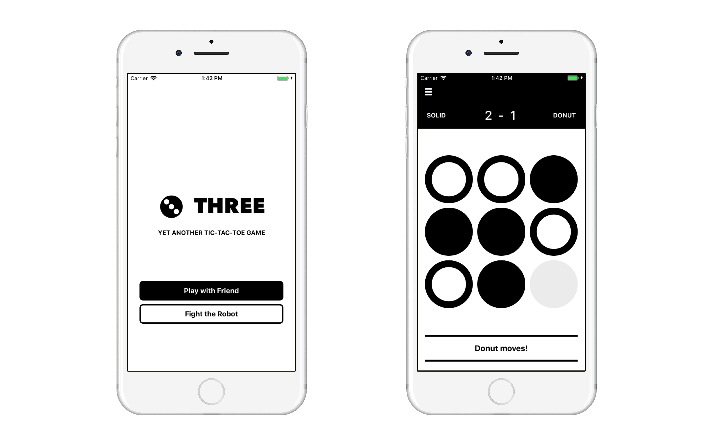

## Three
Yet another Tic-tac-toe game, for iOS, written in Swift.

## Game modes
There are two game modes: Play-with-Friend (multiplayer) and Fight-the-Robot (single player). The Fight-the-Robot mode is implemented using Minimax algorithm.

## Resources
- UI design files can be found [here](https://github.com/Thieurom/App-Designs/tree/master/Three).
- Minimax algorithm: [Wikipedia](https://en.wikipedia.org/wiki/Minimax), [GeeksforGeeks](https://www.geeksforgeeks.org/minimax-algorithm-in-game-theory-set-1-introduction/)
- A quite detailed explanation and a web version of the game by [@jasonrobertfox](https://github.com/jasonrobertfox): [https://www.neverstopbuilding.com/blog/minimax](https://www.neverstopbuilding.com/blog/minimax)

## License
MIT
